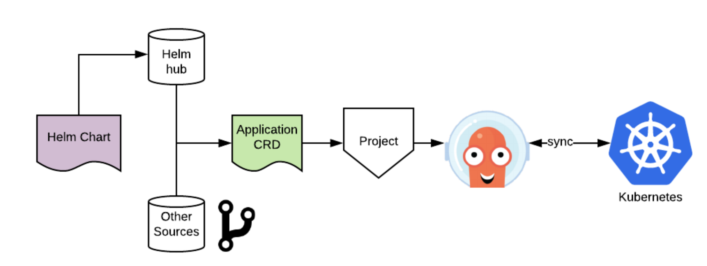

# gitops-in-a-box

_An example of how to work with ArgoCD_

I wanted to show how little code is required to get a declarative ArgoCD pipeline up and running. So with some help from [kind](https://kind.sigs.k8s.io) I did.


## The demo concept

If you are new to ArgoCD go check it [out](https://argoproj.github.io/argo-cd/).

We're going to leverage the Helm chart capability of ArgoCD.
Whilst ordinarily the git source would be what most people are using,
I wanted to illustrate how this platform interplays with Helm which is especially cool as it can be driven via CRD.

This is a simple view of how the fundamental architecture is pinned together.



## Tools you'll need installed
- kubectl
- [Kind](https://kind.sigs.k8s.io/docs/user/quick-start)

## Quick start

_A makefile is used to simplify the developer experience_
```
$make list
argocd
down
get-password
proxy-argo-ui
proxy-kibana-ui
up
```

1. Build a simple local Kubernetes cluster
```
make up
```
2. Install ArgoCD
```
make argocd
```

_This will take a few minutes._


3. Login to the UI
```
$make get-password
argocd-server-b54756f69-9dvbh
```

Now run `make proxy-argo-ui` (_in a new tab_) and use the login of admin + the password from `make get-password`

4. You should see the following.


Let's manually sync them!


Click through to the elasticsearch application to confirm it's booting.


5. Once Elasticsearch and kibana are running use `make proxy-kibana-ui` to view the UX
